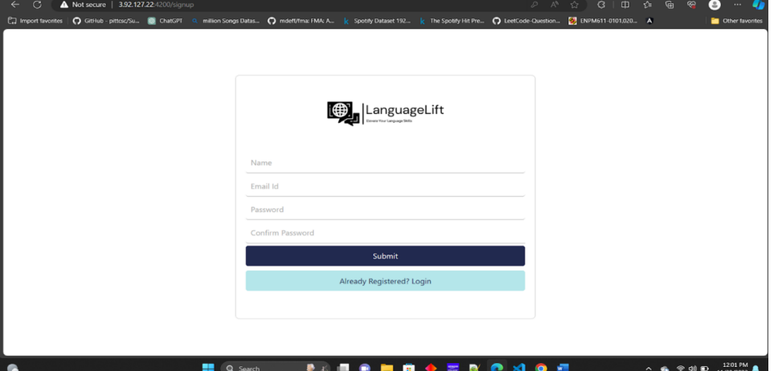

# LanguageLift

This project was generated with [Angular CLI](https://github.com/angular/angular-cli) version 16.2.9.

## Development server

Run `ng serve` for a dev server. Navigate to `http://localhost:4200/`. The application will automatically reload if you change any of the source files.

## Code scaffolding

Run `ng generate component component-name` to generate a new component. You can also use `ng generate directive|pipe|service|class|guard|interface|enum|module`.

## Build

Run `ng build` to build the project. The build artifacts will be stored in the `dist/` directory.

## Running unit tests

Run `ng test` to execute the unit tests via [Karma](https://karma-runner.github.io).

## Running end-to-end tests

Run `ng e2e` to execute the end-to-end tests via a platform of your choice. To use this command, you need to first add a package that implements end-to-end testing capabilities.

## Further help

To get more help on the Angular CLI use `ng help` or go check out the [Angular CLI Overview and Command Reference](https://angular.io/cli) page.

### Project implementation

For implementing this project my team implemented four java spring boot microservices and used mySQL database for the backend.

##Architecture Logical View

  
  

Links for the java spring boot services- 
Quiz Management Service - https://github.com/jayeshpamnani99/Quiz-Management-Service  
Course Content Management Service - https://github.com/jayeshpamnani99/Course-Content-Management-Service  
Enrollment Management Service - https://github.com/jayeshpamnani99/Enrollment-Management-Service   

## Architecture information view

  
  

For further documentation please refer to SOFTWARE ARCHITECTURE AND DETAILED DESIGN DOCUMENT (SADD) https://github.com/anjaneyak10/LanguageLift/blob/master/LanguageLift%20SADD.pdf

Application Pages- 

  
   
  
   
  
  Quiz Submission.png

### Contributors

1. Anjaneya Ketkar
2. Jayesh Pamnani
3. Manav Gupta
4. Divya Lnu
5. Janesh Hasija
